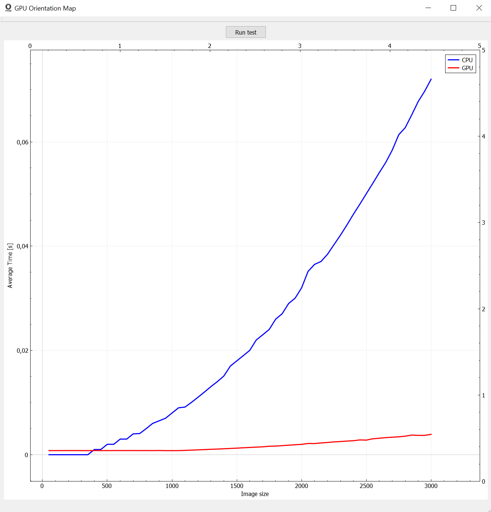

# GPU Fingerprint Orientation Map
Qt project containing a program to demonstrate GPU-based fingerprint orientation map (O-map) calculation. The program executes a performance test of O-map calculation on CPU/GPU backend. During the test, a reference square image size is increased by a constant factor of 50 pixels in both dimensions. Following this, the image's O-map is computed 50 times in a row. This procedure repeats after we hit 3000x3000 size. Average processing times for CPU/GPU are plotted on screen. The measurement below was taken on PC with i7-7700K and NVIDIA Geforce GTX 1080 Ti Founder's Edition Inno3D (without overclocking).

This project depends on the following **3rd-party libraries**:
* [ArrayFire 3.5.1](https://github.com/arrayfire/arrayfire) (minimum), CUDA backend version, minimum CUDA 8.0 
* [OpenCV 3.4.1](https://opencv.org/releases.html) (tested)
* [QCustomPlot 2.0.0](http://www.qcustomplot.com/) (tested)

**Important notice:**
This software was tested only in Windows 10 Education.

For detailed results please consult this [log][].



### Log [log] ###

```cpp
Dimensions: 50 x 50
Time CPU: 0
Time GPU: 0.000794503
CPU/GPU time ratio 0
Dimensions: 100 x 100
Time CPU: 0
Time GPU: 0.000791236
CPU/GPU time ratio 0
Dimensions: 150 x 150
Time CPU: 0
Time GPU: 0.000792938
CPU/GPU time ratio 0
Dimensions: 200 x 200
Time CPU: 0
Time GPU: 0.000799779
CPU/GPU time ratio 0
Dimensions: 250 x 250
Time CPU: 0
Time GPU: 0.000800934
CPU/GPU time ratio 0
Dimensions: 300 x 300
Time CPU: 0
Time GPU: 0.000792762
CPU/GPU time ratio 0
Dimensions: 350 x 350
Time CPU: 0
Time GPU: 0.000789558
CPU/GPU time ratio 0
Dimensions: 400 x 400
Time CPU: 0.001
Time GPU: 0.000799359
CPU/GPU time ratio 1.251
Dimensions: 450 x 450
Time CPU: 0.001
Time GPU: 0.000795834
CPU/GPU time ratio 1.25654
Dimensions: 500 x 500
Time CPU: 0.002
Time GPU: 0.000792094
CPU/GPU time ratio 2.52495
Dimensions: 550 x 550
Time CPU: 0.002
Time GPU: 0.000803519
CPU/GPU time ratio 2.48905
Dimensions: 600 x 600
Time CPU: 0.003
Time GPU: 0.000800744
CPU/GPU time ratio 3.74651
Dimensions: 650 x 650
Time CPU: 0.003
Time GPU: 0.000798867
CPU/GPU time ratio 3.75532
Dimensions: 700 x 700
Time CPU: 0.004
Time GPU: 0.000802646
CPU/GPU time ratio 4.98352
Dimensions: 750 x 750
Time CPU: 0.00406
Time GPU: 0.000796351
CPU/GPU time ratio 5.09826
Dimensions: 800 x 800
Time CPU: 0.005
Time GPU: 0.000803109
CPU/GPU time ratio 6.2258
Dimensions: 850 x 850
Time CPU: 0.006
Time GPU: 0.000792172
CPU/GPU time ratio 7.57411
Dimensions: 900 x 900
Time CPU: 0.0065
Time GPU: 0.000811038
CPU/GPU time ratio 8.01442
Dimensions: 950 x 950
Time CPU: 0.007
Time GPU: 0.000786467
CPU/GPU time ratio 8.90057
Dimensions: 1000 x 1000
Time CPU: 0.008
Time GPU: 0.000784151
CPU/GPU time ratio 10.2021
Dimensions: 1050 x 1050
Time CPU: 0.009
Time GPU: 0.000791826
CPU/GPU time ratio 11.3661
Dimensions: 1100 x 1100
Time CPU: 0.00914
Time GPU: 0.000834507
CPU/GPU time ratio 10.9526
Dimensions: 1150 x 1150
Time CPU: 0.01004
Time GPU: 0.000879066
CPU/GPU time ratio 11.4212
Dimensions: 1200 x 1200
Time CPU: 0.01102
Time GPU: 0.000933231
CPU/GPU time ratio 11.8084
Dimensions: 1250 x 1250
Time CPU: 0.01202
Time GPU: 0.000985976
CPU/GPU time ratio 12.191
Dimensions: 1300 x 1300
Time CPU: 0.01306
Time GPU: 0.00103941
CPU/GPU time ratio 12.5648
Dimensions: 1350 x 1350
Time CPU: 0.01402
Time GPU: 0.00108259
CPU/GPU time ratio 12.9504
Dimensions: 1400 x 1400
Time CPU: 0.0151
Time GPU: 0.00114461
CPU/GPU time ratio 13.1923
Dimensions: 1450 x 1450
Time CPU: 0.017
Time GPU: 0.00120131
CPU/GPU time ratio 14.1512
Dimensions: 1500 x 1500
Time CPU: 0.018
Time GPU: 0.00126135
CPU/GPU time ratio 14.2704
Dimensions: 1550 x 1550
Time CPU: 0.019
Time GPU: 0.00133212
CPU/GPU time ratio 14.263
Dimensions: 1600 x 1600
Time CPU: 0.02002
Time GPU: 0.00139663
CPU/GPU time ratio 14.3345
Dimensions: 1650 x 1650
Time CPU: 0.022
Time GPU: 0.0014585
CPU/GPU time ratio 15.084
Dimensions: 1700 x 1700
Time CPU: 0.023
Time GPU: 0.00151757
CPU/GPU time ratio 15.1558
Dimensions: 1750 x 1750
Time CPU: 0.02402
Time GPU: 0.00161994
CPU/GPU time ratio 14.8278
Dimensions: 1800 x 1800
Time CPU: 0.026
Time GPU: 0.00166107
CPU/GPU time ratio 15.6526
Dimensions: 1850 x 1850
Time CPU: 0.02704
Time GPU: 0.00174146
CPU/GPU time ratio 15.5272
Dimensions: 1900 x 1900
Time CPU: 0.029
Time GPU: 0.00182908
CPU/GPU time ratio 15.855
Dimensions: 1950 x 1950
Time CPU: 0.03002
Time GPU: 0.0019122
CPU/GPU time ratio 15.6992
Dimensions: 2000 x 2000
Time CPU: 0.032
Time GPU: 0.00198166
CPU/GPU time ratio 16.1481
Dimensions: 2050 x 2050
Time CPU: 0.03516
Time GPU: 0.00215926
CPU/GPU time ratio 16.2834
Dimensions: 2100 x 2100
Time CPU: 0.0365
Time GPU: 0.00214331
CPU/GPU time ratio 17.0297
Dimensions: 2150 x 2150
Time CPU: 0.03706
Time GPU: 0.002256
CPU/GPU time ratio 16.4273
Dimensions: 2200 x 2200
Time CPU: 0.03844
Time GPU: 0.00234639
CPU/GPU time ratio 16.3826
Dimensions: 2250 x 2250
Time CPU: 0.04028
Time GPU: 0.00245992
CPU/GPU time ratio 16.3745
Dimensions: 2300 x 2300
Time CPU: 0.0421
Time GPU: 0.00253243
CPU/GPU time ratio 16.6244
Dimensions: 2350 x 2350
Time CPU: 0.04406
Time GPU: 0.00261721
CPU/GPU time ratio 16.8347
Dimensions: 2400 x 2400
Time CPU: 0.04612
Time GPU: 0.00268557
CPU/GPU time ratio 17.1732
Dimensions: 2450 x 2450
Time CPU: 0.04806
Time GPU: 0.0028389
CPU/GPU time ratio 16.9291
Dimensions: 2500 x 2500
Time CPU: 0.05006
Time GPU: 0.00280095
CPU/GPU time ratio 17.8725
Dimensions: 2550 x 2550
Time CPU: 0.05206
Time GPU: 0.00305824
CPU/GPU time ratio 17.0229
Dimensions: 2600 x 2600
Time CPU: 0.0541
Time GPU: 0.00316068
CPU/GPU time ratio 17.1166
Dimensions: 2650 x 2650
Time CPU: 0.05606
Time GPU: 0.00328119
CPU/GPU time ratio 17.0853
Dimensions: 2700 x 2700
Time CPU: 0.05842
Time GPU: 0.00335982
CPU/GPU time ratio 17.3878
Dimensions: 2750 x 2750
Time CPU: 0.06136
Time GPU: 0.00343178
CPU/GPU time ratio 17.8799
Dimensions: 2800 x 2800
Time CPU: 0.06272
Time GPU: 0.00356051
CPU/GPU time ratio 17.6155
Dimensions: 2850 x 2850
Time CPU: 0.06516
Time GPU: 0.00376477
CPU/GPU time ratio 17.3078
Dimensions: 2900 x 2900
Time CPU: 0.06772
Time GPU: 0.00371102
CPU/GPU time ratio 18.2484
Dimensions: 2950 x 2950
Time CPU: 0.0697
Time GPU: 0.00370669
CPU/GPU time ratio 18.8038
Dimensions: 3000 x 3000
Time CPU: 0.07202
Time GPU: 0.00391018
CPU/GPU time ratio 18.4186
```
