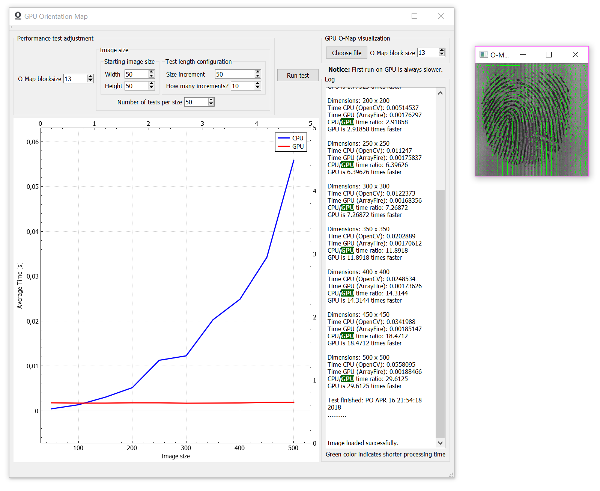

# GPU-based Fingerprint Orientation Map
Qt project containing a program to demonstrate GPU-based fingerprint orientation map (O-map) calculation. The program executes a performance test of O-map calculation on CPU/GPU backend. During the test, a reference square image size is increased by a constant factor of 50 pixels in both dimensions. Following this, the image's O-map is computed 50 times in a row. This procedure repeats after we hit 3000x3000 size. Average processing times for CPU/GPU are plotted on screen. The measurement below was taken on PC with [i7-7700K](https://ark.intel.com/products/97129/Intel-Core-i7-7700K-Processor-8M-Cache-up-to-4_50-GHz) and [NVIDIA Geforce GTX 1080 Ti Founder's Edition Inno3D](http://www.inno3d.com/products_detail.php?refid=279) (without overclocking).

This app can also display O-map of user selected grayscale image to verify the accuracy estimation.

This project depends on the following **3rd-party libraries**:
* [ArrayFire 3.5.1](https://github.com/arrayfire/arrayfire) (minimum), CUDA backend version, minimum CUDA 8.0 
* [OpenCV 3.4.1](https://opencv.org/releases.html) (tested)
* [QCustomPlot 2.0.0](http://www.qcustomplot.com/) (tested)

You need to provide valid paths to these libraries and their header files in `.pro` file.

**Important notice:**
This software was tested only in Windows 10 Education.

This app calculates **per-pixel (advanced) O-Map**. Standard (basic) O-map represents matrix of directions on per-block basis. For high-accuracy adaptive Gabor filtering we need per-pixel O-map to able to enhance curved ridge lines with maximum effect. The image below shows the difference between both O-map types.

Basic O-map

Advanced O-map

